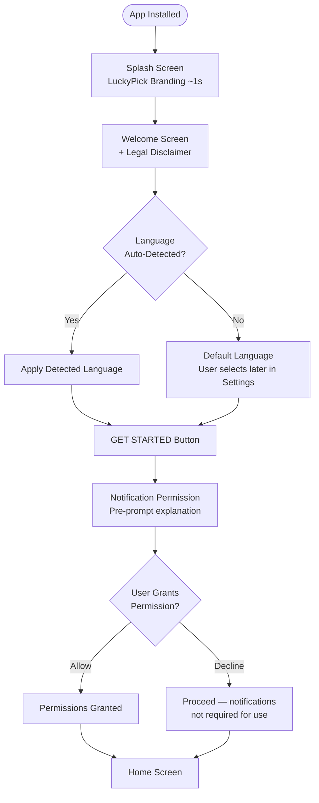
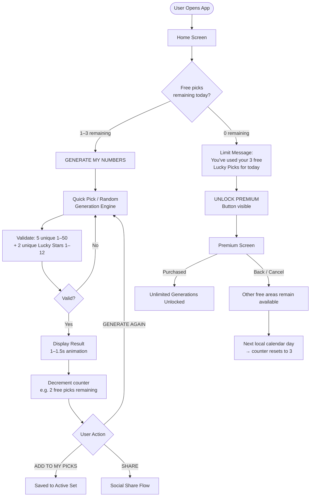
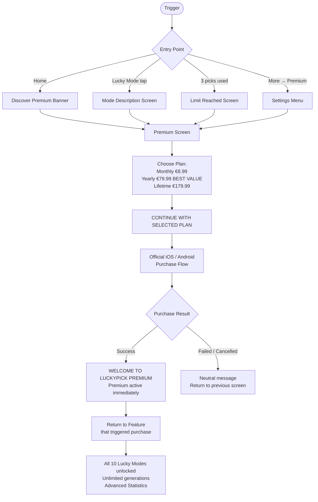
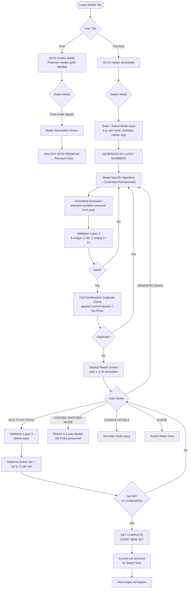
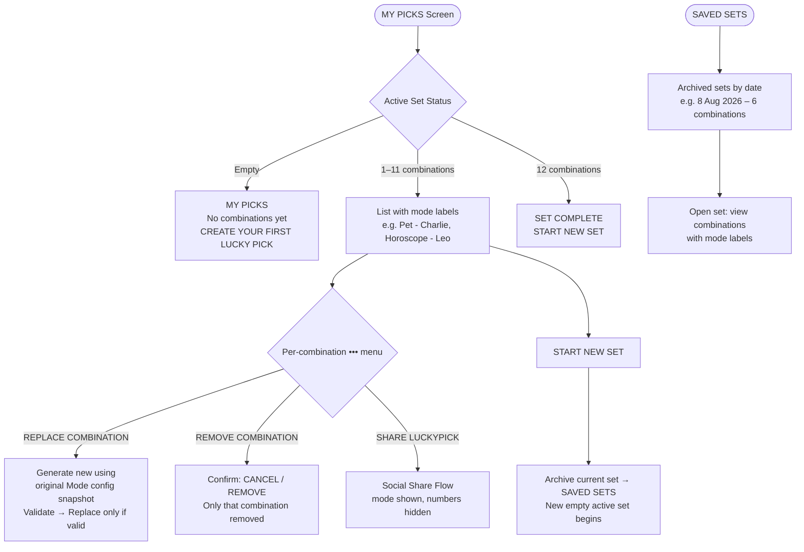
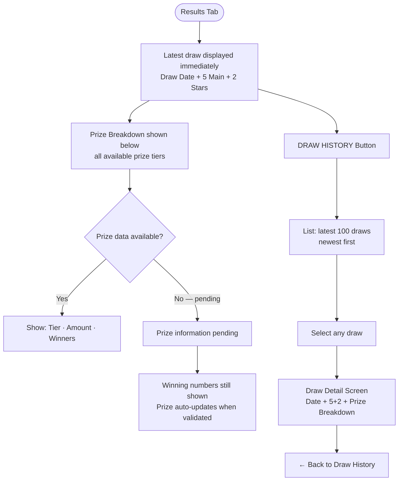
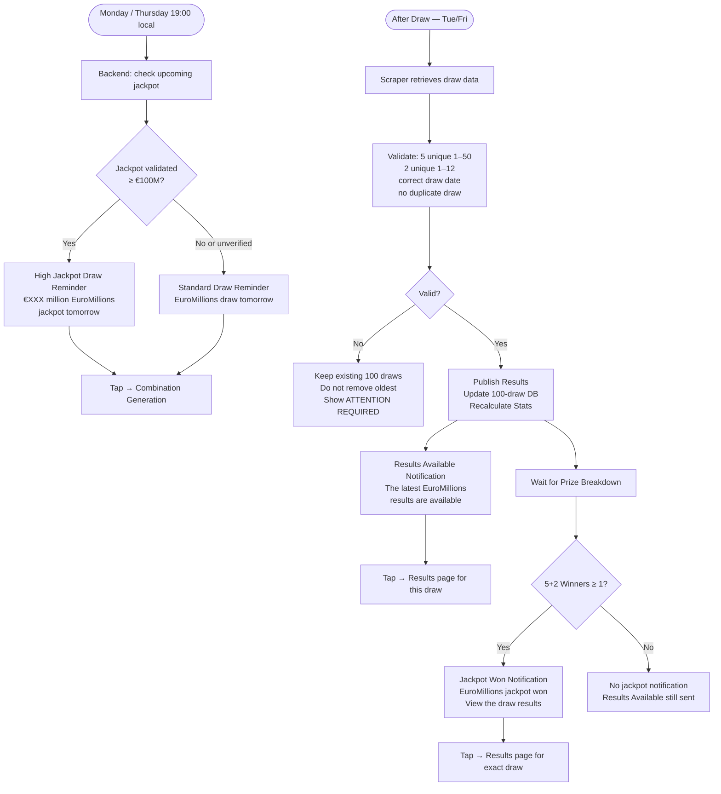
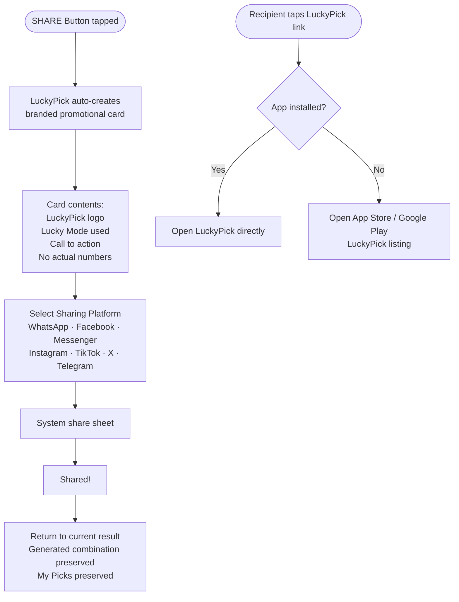
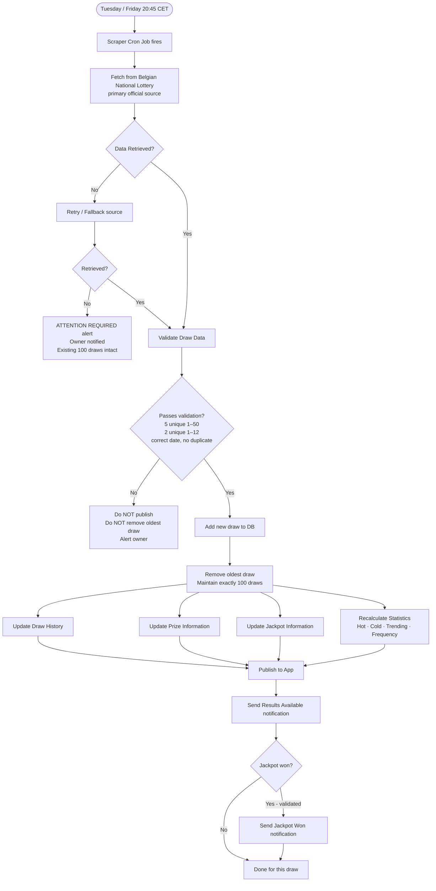

#  Application Flow

Complete user journey maps for every major flow in LuckyPick EuroMillions.

---

##  1. First Launch & Onboarding



!!! note "Rules"
    - No mandatory account creation.
    - No immediate paywall on launch.
    - Legal disclaimer always visible at the bottom of the Welcome Screen.

---

##  2. Free User Daily Generation Flow



---

##  3. Premium Discovery & Purchase Flow



!!! warning "Critical Rules"
    - No free trial at launch.
    - No aggressive retry paywalls after a failed purchase.
    - Existing My Picks and Saved Sets are **never** deleted during the premium flow.
    - Yearly plan marked **BEST VALUE** — MOST POPULAR only once genuine data confirms it.

---

##  4. Lucky Mode Generation Flow (General)



---

##  5. Individual Lucky Mode Input Flows

=== "Birthday Mode"
    ```mermaid
    flowchart LR
        A[Enter Name/Nickname\noptional] --> B[Enter Date of Birth\nDay + Month + Year]
        B --> C[Birthday transformed to\ninternal numerical profile\nnot raw day/month values]
        C --> D[Profile seeds\nfull 1–50 range available]
        D --> E[Generate 5+2\nwith entropy filler if needed]
    ```

=== "Horoscope Mode"
    ```mermaid
    flowchart LR
        A[Enter Day + Month only\nno birth year] --> B[LuckyPick determines\nZodiac Sign automatically]
        B --> C[Each sign has its own\nnumerical profile/seed]
        C --> D[Controlled randomness\nprovides variation]
        D --> E[Generate 5+2]
    ```

=== "Pet Mode"
    ```mermaid
    flowchart LR
        A[Enter Pet Name] --> B[Select Animal Type\nDog · Cat · Bird · Horse\nRabbit · Fish · Other]
        B --> C[Name + Type form\npersonal profile]
        C --> D[Generate 5+2]
        D --> E{More pets?}
        E -->|CHANGE PET| A
        E -->|Generate Again| D
    ```

=== "Family Mode"
    ```mermaid
    flowchart TD
        A[Add Family Member\nRelationship + Name + DOB] --> B{Add more?}
        B -->|+ADD FAMILY MEMBER| A
        B -->|Done| C[All members form\ncollective profile]
        C --> D[Generate 5+2]
        D --> E{Action}
        E -->|EDIT FAMILY| A
        E -->|START NEW FAMILY| F[New family profile]
        E -->|Generate Again| D
    ```

=== "Lucky Color Mode"
    ```mermaid
    flowchart LR
        A[Display 10 colour circles\nBlue·Gold·Red·Green·Purple\nOrange·Pink·White·Black·Turquoise] --> B{Select}
        B -->|Pick one| C[Selected colour has\nits own numerical profile]
        B -->|SURPRISE ME| D[Random colour chosen\nuses that colour's profile]
        C --> E[Generate 5+2\nBall colours unchanged]
        D --> E
    ```

=== "Lucky Number Mode"
    ```mermaid
    flowchart LR
        A[Enter 1–3 Lucky Numbers\neach between 1–50] --> B[Selected numbers\nare MANDATORY in every combination]
        B --> C[Insert lucky numbers first\nExclude from remaining pool]
        C --> D[Generate remaining\n4/3/2 Main Numbers\nfrom 1–50 excl. selected]
        D --> E[Generate 2 Lucky Stars\nfrom 1–12 independently]
        E --> F[Valid 5+2 Result]
    ```

=== "Hot / Cold / Trending"
    ```mermaid
    flowchart TD
        A[100-draw rolling DB] --> B{Mode}
        B -->|Hot| C[Top 10 Main Numbers\nTop 4 Lucky Stars]
        B -->|Cold| D[Bottom 10 Main Numbers\nBottom 4 Lucky Stars]
        B -->|Trending| E[Latest 20 vs Latest 100\nTop 10 upward movers\nTop 4 Lucky Stars movers]

        C --> F[3 from Hot Pool\n+ 2 from remaining 40\n1 from Hot Stars\n+ 1 from remaining 8]
        D --> G[3 from Cold Pool\n+ 2 from remaining 40\n1 from Cold Stars\n+ 1 from remaining 8]
        E --> H[3 Trending Main\n+ 2 remaining\n1 Trending Star\n+ 1 remaining]

        F --> I[Controlled distribution\nto avoid excessive repetition]
        G --> I
        H --> I
        I --> J[Valid 5+2 Result]
    ```

=== "Smart Mix Mode"
    ```mermaid
    flowchart TD
        A[No personal input required] --> B[Step 1: Pick 1 Hot Number → exclude it]
        B --> C[Step 2: Pick 1 Cold Number → exclude both]
        C --> D[Step 3: Pick 1 Trending Number\nexclude used; skip if already selected]
        D --> E[Step 4: Pick 1 Random Number\nfrom remaining pool]
        E --> F[Step 5: Pick 1 Random Number\nfrom remaining pool]
        F --> G[Result: 1 Hot + 1 Cold + 1 Trending + 2 Random]
        G --> H[Lucky Stars:\n1 Statistical Star Hot/Cold/Trending\n+ 1 Random Star\nwith immediate exclusion]
        H --> I[Valid 5+2 Result]
    ```

---

##  6. My Picks Management Flow



!!! info "Core Rule"
    Once saved, a combination is **never** changed automatically. Only explicit `REPLACE COMBINATION` or `REMOVE COMBINATION` can modify it.

---

##  7. Results & Draw History Flow



---

##  8. Notification Decision Flow



!!! warning "Hard Limits"
    - Maximum **3 notifications per draw**: 1 Draw Reminder + 1 Results Available + 1 Jackpot Won.
    - Standard two-draw week: maximum **6 notifications total**.
    - `€100M+` Reminder **replaces** the Standard Reminder — never creates a second pre-draw notification.

---

##  9. Social Sharing Flow



!!! danger "Privacy — Absolute Rule"
    Shared content must **never** include: generated Main Numbers, Lucky Stars, pet names, birth dates, names, family info, Lucky Numbers entered, or My Picks combinations. Only the Lucky Mode name may be displayed.

---

##  10. Backend Automation Pipeline


