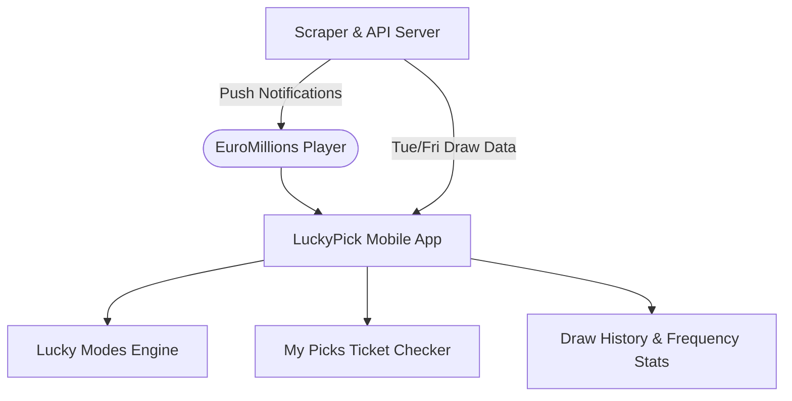

#  LuckyPick EuroMillions

Version 1.0 100% Ad-Free iOS & Android

Welcome to the official technical and product documentation for **LuckyPick EuroMillions**.

---

##  Project Goal

The primary goal of **LuckyPick EuroMillions** is to create the **premier companion application** for EuroMillions lottery players across Europe. The application seamlessly combines a sleek **Dark Blue & Gold** modern design with useful lottery tools, advanced statistics, and unique personalized number generation logic (**"Lucky Modes"**).

---

##  Key Differentiators

* **100% Advertising-Free:** Zero intrusive banner ads or modal video pop-ups.
* **Personalized Lucky Modes:** Generates ticket combinations using birthdays, zodiac signs, pet names, family milestones, and historical frequency logic.
* **Smart Ticket Checker:** Auto-validates saved ticket combinations against published draw results, calculating winnings across all **13 official prize tiers**.
* **High Jackpot Push Alerts:** Instant notifications when EuroMillions jackpots hit landmark sums (e.g. **€100 Million+**).
* **Privacy-First Sharing:** Share custom lucky cards without exposing personal birthdays or names.

---

##  Navigation Sitemap

| Documentation Section | Description |
| :--- | :--- |
| [**Architecture**](architecture.md) | High-level system structure, section ordering, and tech stack |
| [**Core Features**](features/overview.md) | Overview of free vs premium feature breakdown |
| [**Lucky Modes**](features/lucky-modes.md) | Detailed algorithms for Birthday, Horoscope, Pet, Family & Frequency modes |
| [**My Picks Manager**](features/my-picks.md) | Ticket collection, duplicate filtering, and validation checker |
| [**Results & History**](features/results-history.md) | Tuesday/Friday draw updates, 13 prize tiers, and 100-draw database |
| [**Notifications**](features/notifications.md) | Draw cutoff reminders and €100M+ jackpot alerts |
| [**Premium & Purchases**](features/premium.md) | StoreKit 2 & Google Play Billing subscription model |
| [**Backend & Admin**](backend-admin.md) | Automated scraper engine and owner control panel |
| [**Website & Deep Links**](website.md) | Promotional landing page (`luckypick.eu`) and smart URL routing |
| [**Development & Launch**](development-launch.md) | QA testing plan, CI/CD pipeline, and App Store checklist |

---

##  Design Theme Specification

* **Primary Background:** Dark Blue (`#0D1B2A`)
* **Card Container:** Midnight Navy (`#1B263B`)
* **Accent & Highlights:** Metallic Gold (`#E0A96D`)
* **Typography:** Clean, high-contrast, modern sans-serif.
