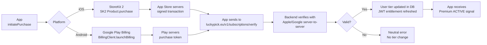
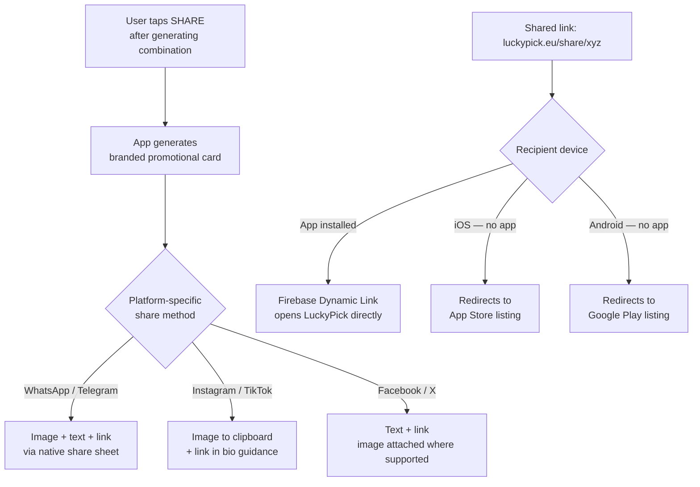

#  System Design

Complete technical architecture, database schema, API design, and infrastructure specification for LuckyPick EuroMillions.

---

##  1. Architecture Overview

LuckyPick follows an **offline-first** architecture with a thin cloud backend responsible only for authoritative lottery data and push notifications. All generation logic runs **entirely on-device** — the backend never generates numbers.

```
┌─────────────────────────────────────────────────────────────────────┐
│                     MOBILE CLIENT (Flutter)                         │
│                                                                     │
│  ┌──────────────┐  ┌──────────────┐  ┌─────────────────────────┐  │
│  │  Presentation│  │  Generation  │  │  Local Persistence      │  │
│  │  (Screens /  │  │  Engine      │  │  SQLite / Hive          │  │
│  │   Widgets)   │  │  10 Modes +  │  │  My Picks · Saved Sets  │  │
│  │              │  │  Quick Pick  │  │  Mode Inputs · Settings  │  │
│  └──────┬───────┘  └──────┬───────┘  └───────────┬─────────────┘  │
│         │                 │                        │               │
│  ┌──────▼─────────────────▼───────────────────────▼─────────────┐  │
│  │              State Management (Provider / BLoC / Riverpod)    │  │
│  └──────────────────────────────┬────────────────────────────────┘  │
│                                 │ HTTPS REST                        │
└─────────────────────────────────┼───────────────────────────────────┘
                                  │
┌─────────────────────────────────▼───────────────────────────────────┐
│                          CLOUD BACKEND                              │
│                                                                     │
│  ┌──────────────┐  ┌────────────────┐  ┌─────────────────────────┐  │
│  │  REST API    │  │  Scraper       │  │  Admin Control Panel    │  │
│  │  Server      │  │  Cron Engine   │  │  luckypick.eu/admin     │  │
│  │              │  │  Tue/Fri 20:45 │  │  Non-technical UI       │  │
│  └──────┬───────┘  └───────┬────────┘  └─────────────────────────┘  │
│         │                  │                                         │
│  ┌──────▼──────────────────▼───────────────────────────────────┐    │
│  │  PostgreSQL — 100-draw rolling DB + Users + Subscriptions   │    │
│  └─────────────────────────────────────────────────────────────┘    │
│  ┌──────────────────────────────────────────────────────────────┐    │
│  │  Redis — Latest draw & statistics cache                      │    │
│  └──────────────────────────────────────────────────────────────┘    │
└─────────────────────────────────────────────────────────────────────┘
```

### Key Design Decisions

| Decision | Rationale |
| :--- | :--- |
| **Generation fully on-device** | Zero latency, no server dependency for core feature |
| **100-draw rolling window** | Keeps DB small, statistics always current |
| **Belgian National Lottery as primary source** | Official, authoritative, no guessing |
| **Fail-safe draw ingestion** | New draw added → oldest removed ONLY after successful validation |
| **No LuckyPick account required** | Reduces friction; IAP tied to Apple ID / Google account |
| **StoreKit 2 + Google Play Billing** | Native, secure, store-managed entitlements |

---

##  2. Database Schema

### 2.1 `draws` Table (Core — 100-row rolling window)

```sql
CREATE TABLE draws (
    id              UUID PRIMARY KEY DEFAULT gen_random_uuid(),
    draw_date       DATE NOT NULL UNIQUE,
    main_numbers    INTEGER[5] NOT NULL,   -- sorted ascending, values 1–50
    lucky_stars     INTEGER[2] NOT NULL,   -- sorted ascending, values 1–12
    jackpot_won     BOOLEAN NOT NULL DEFAULT FALSE,
    jackpot_winners INTEGER NOT NULL DEFAULT 0,
    is_validated    BOOLEAN NOT NULL DEFAULT FALSE,
    prize_pending   BOOLEAN NOT NULL DEFAULT TRUE,
    created_at      TIMESTAMPTZ NOT NULL DEFAULT NOW(),
    published_at    TIMESTAMPTZ,

    CONSTRAINT main_count CHECK (array_length(main_numbers, 1) = 5),
    CONSTRAINT star_count  CHECK (array_length(lucky_stars, 1) = 2)
);

CREATE INDEX idx_draws_date ON draws(draw_date DESC);
```

### 2.2 `prize_tiers` Table

```sql
CREATE TABLE prize_tiers (
    id              UUID PRIMARY KEY DEFAULT gen_random_uuid(),
    draw_id         UUID NOT NULL REFERENCES draws(id) ON DELETE CASCADE,
    tier_number     SMALLINT NOT NULL,          -- 1 (jackpot) through 13
    match_desc      TEXT NOT NULL,              -- e.g. "5 + 2 Lucky Stars"
    prize_amount    NUMERIC(15, 2),             -- NULL while prize_pending
    winner_count    INTEGER NOT NULL DEFAULT 0,

    UNIQUE (draw_id, tier_number)
);
```

### 2.3 `statistics` Table (auto-recalculated)

```sql
CREATE TABLE statistics (
    id                      UUID PRIMARY KEY DEFAULT gen_random_uuid(),
    calculated_at           TIMESTAMPTZ NOT NULL DEFAULT NOW(),
    reference_draws         INTEGER NOT NULL DEFAULT 100,
    main_frequency          JSONB NOT NULL,    -- {"1": 18, "2": 22, ... "50": 14}
    star_frequency          JSONB NOT NULL,    -- {"1": 42, ... "12": 38}
    hot_main                INTEGER[] NOT NULL,   -- top 10
    cold_main               INTEGER[] NOT NULL,   -- bottom 10
    trending_main           INTEGER[] NOT NULL,   -- top 10 by recent uplift
    hot_stars               INTEGER[] NOT NULL,   -- top 4
    cold_stars              INTEGER[] NOT NULL,   -- bottom 4
    trending_stars          INTEGER[] NOT NULL,   -- top 4
    trending_ref_draws      INTEGER NOT NULL DEFAULT 20
);

-- Only the latest row is authoritative
CREATE INDEX idx_stats_latest ON statistics(calculated_at DESC);
```

### 2.4 `users` Table

```sql
CREATE TABLE users (
    id                  UUID PRIMARY KEY DEFAULT gen_random_uuid(),
    device_id           TEXT UNIQUE,          -- anonymous device fingerprint
    fcm_token           TEXT,
    apns_token          TEXT,
    preferred_language  CHAR(2) NOT NULL DEFAULT 'en',
    notif_draw_reminder BOOLEAN NOT NULL DEFAULT TRUE,
    notif_results       BOOLEAN NOT NULL DEFAULT TRUE,
    notif_jackpot_won   BOOLEAN NOT NULL DEFAULT TRUE,
    tier                TEXT NOT NULL DEFAULT 'free',
    created_at          TIMESTAMPTZ NOT NULL DEFAULT NOW(),
    last_seen_at        TIMESTAMPTZ
);
```

### 2.5 `subscriptions` Table

```sql
CREATE TABLE subscriptions (
    id                  UUID PRIMARY KEY DEFAULT gen_random_uuid(),
    user_id             UUID NOT NULL REFERENCES users(id),
    plan_type           TEXT NOT NULL CHECK (plan_type IN ('monthly', 'yearly', 'lifetime')),
    platform            TEXT NOT NULL CHECK (platform IN ('ios', 'android')),
    store_transaction   TEXT NOT NULL UNIQUE,
    original_transaction TEXT,
    starts_at           TIMESTAMPTZ NOT NULL,
    expires_at          TIMESTAMPTZ,           -- NULL for lifetime
    is_active           BOOLEAN NOT NULL DEFAULT TRUE,
    created_at          TIMESTAMPTZ NOT NULL DEFAULT NOW()
);

CREATE INDEX idx_subs_user ON subscriptions(user_id, is_active);
```

### 2.6 `scraper_runs` Table (audit log)

```sql
CREATE TABLE scraper_runs (
    id              UUID PRIMARY KEY DEFAULT gen_random_uuid(),
    triggered_at    TIMESTAMPTZ NOT NULL DEFAULT NOW(),
    draw_date       DATE,
    status          TEXT NOT NULL CHECK (status IN ('success', 'validation_failed', 'fetch_failed')),
    draw_id         UUID REFERENCES draws(id),
    error_message   TEXT,
    completed_at    TIMESTAMPTZ
);
```

---

##  3. REST API Design

**Base URL:** `https://api.luckypick.eu/v1`

All endpoints return JSON. Authentication uses device-tied JWT for user-specific endpoints.

### 3.1 Draw & Results Endpoints

| Method | Path | Description | Auth |
| :---: | :--- | :--- | :---: |
| `GET` | `/draws/latest` | Latest validated draw + prize breakdown | None |
| `GET` | `/draws` | Paginated draw history (max 100) | None |
| `GET` | `/draws/{drawId}` | Single draw detail with prize breakdown | None |
| `GET` | `/statistics/latest` | Latest hot/cold/trending/frequency stats | None |

**`GET /draws/latest` Response:**
```json
{
  "draw": {
    "id": "uuid",
    "draw_date": "2026-08-08",
    "main_numbers": [5, 14, 27, 36, 48],
    "lucky_stars": [3, 11],
    "jackpot_won": true,
    "jackpot_winners": 1,
    "prize_pending": false,
    "prize_tiers": [
      { "tier": 1, "match": "5+2 Lucky Stars", "amount": 68000000.00, "winners": 1 },
      { "tier": 2, "match": "5+1 Lucky Star",  "amount": 312456.78,   "winners": 3 }
    ]
  }
}
```

**`GET /statistics/latest` Response:**
```json
{
  "stats": {
    "calculated_at": "2026-08-08T23:15:00Z",
    "reference_draws": 100,
    "main_frequency": { "1": 18, "7": 24, "44": 31 },
    "hot_main": [44, 7, 23, 17, 35, 9, 12, 48, 6, 31],
    "cold_main": [3, 50, 19, 42, 11, 28, 4, 45, 33, 16],
    "trending_main": [7, 44, 23, 11, 17, 3, 29, 38, 14, 9],
    "hot_stars": [3, 7, 11, 9],
    "cold_stars": [12, 1, 5, 6],
    "trending_stars": [7, 3, 11, 9]
  }
}
```

### 3.2 User & Notification Endpoints

| Method | Path | Description | Auth |
| :---: | :--- | :--- | :---: |
| `POST` | `/users/register` | Register device, obtain JWT | None |
| `PATCH` | `/users/me/push-token` | Update FCM/APNs token | JWT |
| `PATCH` | `/users/me/notifications` | Update notification prefs | JWT |
| `GET` | `/users/me/tier` | Get current premium tier | JWT |

### 3.3 Subscription Endpoints

| Method | Path | Description | Auth |
| :---: | :--- | :--- | :---: |
| `POST` | `/subscriptions/verify` | Verify store receipt → activate premium | JWT |
| `POST` | `/subscriptions/restore` | Re-validate and restore prior purchase | JWT |
| `GET` | `/subscriptions/me` | Current subscription status | JWT |

### 3.4 Admin Endpoints (Owner Panel — separate auth)

| Method | Path | Description |
| :---: | :--- | :--- |
| `GET` | `/admin/status` | System health overview |
| `GET` | `/admin/draws/latest` | Latest imported draw |
| `PATCH` | `/admin/draws/{id}` | Correct draw numbers or prize info |
| `PATCH` | `/admin/jackpot` | Correct upcoming jackpot amount |
| `GET` | `/admin/activity` | Latest automation activity log |
| `POST` | `/admin/push/broadcast` | Manual push notification dispatch |
| `GET` | `/admin/scraper/runs` | Scraper run history + status |

---

##  4. Generation Engine Design

The engine runs **entirely client-side** in Dart. No network call required to generate a combination.

### 4.1 Core Validation Rules (applied to every mode)

```
HARD RULES — enforced before any combination is displayed or saved:

1. main_numbers.length == 5
2. main_numbers.every((n) => n >= 1 && n <= 50)
3. main_numbers.toSet().length == 5          // all unique
4. lucky_stars.length == 2
5. lucky_stars.every((s) => s >= 1 && s <= 12)
6. lucky_stars.toSet().length == 2           // all unique
7. !isDuplicateInSession(combination)
```

### 4.2 Immediate Exclusion Protocol

All modes use this protocol to guarantee no duplicate numbers within a single combination:

```
selectedPool = full range (1–50 for main, 1–12 for stars)

Step 1: Insert any mandatory numbers (Lucky Number Mode)
        → Remove them from selectedPool immediately

Step 2: Select next required number from selectedPool
        → Remove it from selectedPool immediately

Repeat Step 2 until 5 main numbers + 2 stars selected
```

### 4.3 Mode-Specific Input → Profile Mapping

| Mode | Input | Internal Profile |
| :--- | :--- | :--- |
| Birthday | Name (opt) + DD/MM/YYYY | Year-transformed numerical seed covering full 1–50 range |
| Horoscope | DD/MM → Zodiac sign | Each of 12 signs has a fixed numerical weight table |
| Pet | Pet name + animal type | Name hash (letter values) × animal type multiplier |
| Family | Multiple members: relationship + name + DOB | Aggregate weighted hash of all member profiles |
| Lucky Color | One of 10 colors | Each color has a fixed prime-based seed profile |
| Lucky Number | 1–3 numbers (1–50) | Mandatory inclusion; remaining numbers generated from reduced pool |
| Hot Numbers | Drawn from top-10 hot pool | 3 from hot pool + 2 from remaining 40 |
| Cold Numbers | Drawn from bottom-10 cold pool | 3 from cold pool + 2 from remaining 40 |
| Trending | Top 10 recent-uplift numbers | 3 trending + 2 from remaining |
| Smart Mix | Automatic | Sequential: 1 Hot → 1 Cold → 1 Trending → 2 Random |

### 4.4 Quick Pick (Free)

Pure cryptographically seeded random selection. No mode input. Counter tracked client-side by local calendar day, reset at midnight local time.

---

##  5. Push Notification System Design

### 5.1 Notification Types & Triggers

```
TYPE 1: Draw Reminder
  Schedule: Monday 19:00 local → for Tuesday draw
            Thursday 19:00 local → for Friday draw
  Variant:  Standard (jackpot < €100M or unverified)
            High Jackpot (jackpot ≥ €100M, validated)
  Deep link: Lucky Modes / Combination Generation

TYPE 2: Results Available
  Trigger:  After scraper successfully validates draw numbers
  Constraint: Only after validation — never speculative
  Deep link: Results screen for that specific draw ID

TYPE 3: Jackpot Won
  Trigger:  After prize breakdown validated AND 5+2 winners ≥ 1
  Constraint: Absolute zero tolerance — never send if winners = 0
  Deep link: Results screen for that exact draw ID
```

### 5.2 Notification Payload Structures

**Draw Reminder (Standard):**
```json
{
  "title": "LuckyPick",
  "body": "EuroMillions draw tomorrow. Create your LuckyPick combinations.",
  "data": { "type": "draw_reminder", "draw_date": "2026-08-11" }
}
```

**High Jackpot Reminder:**
```json
{
  "title": "LuckyPick",
  "body": "€145 million EuroMillions jackpot tomorrow. Create your LuckyPick combinations.",
  "data": { "type": "high_jackpot_reminder", "draw_date": "2026-08-12", "jackpot": 145000000 }
}
```

**Results Available:**
```json
{
  "title": "LuckyPick",
  "body": "The latest EuroMillions results are available. View the latest draw results.",
  "data": { "type": "results_available", "draw_id": "uuid", "draw_date": "2026-08-12" }
}
```

**Jackpot Won:**
```json
{
  "title": "LuckyPick",
  "body": "EuroMillions jackpot won. View the draw results.",
  "data": { "type": "jackpot_won", "draw_id": "uuid", "draw_date": "2026-08-12" }
}
```

### 5.3 Per-Draw Notification Limits

```
Maximum per draw:
  ✓ 1 × Draw Reminder (Standard OR High Jackpot — never both)
  ✓ 1 × Results Available
  ✓ 1 × Jackpot Won (only if winners ≥ 1)

Standard two-draw week maximum: 6 total notifications
```

---

##  6. In-App Purchase Architecture



### Product IDs

| Plan | iOS Product ID | Android Product ID |
| :--- | :--- | :--- |
| Monthly | `eu.luckypick.premium.monthly` | `eu.luckypick.premium.monthly` |
| Yearly | `eu.luckypick.premium.yearly` | `eu.luckypick.premium.yearly` |
| Lifetime | `eu.luckypick.premium.lifetime` | `eu.luckypick.premium.lifetime` |

---

##  7. Social Sharing & Deep Link System



### Sharing Card Content Rules

| Always Include | Never Include |
| :--- | :--- |
| LuckyPick logo | Generated Main Numbers |
| Lucky Mode used | Generated Lucky Stars |
| Short promotional message | Pet names |
| One-click deep link | Birth dates or names |
| LuckyPick ball/star decorative elements | Family member details |
| | Lucky Numbers entered by user |
| | My Picks or Saved Sets |

---

##  8. Admin Control Panel Design

The Owner Control Panel is designed for a **non-technical owner**. It must feel like a simple website.

### 8.1 Status Dashboard

```
LUCKYPICK ADMIN
━━━━━━━━━━━━━━━━━━━━━━━━━━━━━━━━━━━━━━
SYSTEM STATUS
  Latest Draw          ✓ OK
  Prize Information    ✓ OK
  Statistics           ✓ OK
  Jackpot              ✓ OK

  Everything is up to date.

LATEST ACTIVITY (last 7 days)
  2026-08-12 21:02  New draw imported       ✓ OK
  2026-08-12 21:03  Statistics recalculated ✓ OK
  2026-08-12 21:04  Prize info updated      ✓ OK
  2026-08-12 21:04  Push notifications sent ✓ OK
```

### 8.2 Owner-Editable Functions

| Function | Description |
| :--- | :--- |
| View latest draw | Inspect the most recently imported draw |
| Correct jackpot | Update the advertised upcoming jackpot amount |
| Correct a draw | Fix an incorrect number set (triggers re-validation) |
| Correct prize info | Amend prize amounts or winner counts |
| Change editable text | Update app-served copy (e.g. disclaimer text) |
| View warning | Review and resolve ATTENTION REQUIRED alerts |

### 8.3 Owner Guide (9 Items)

1. How to log in
2. How to check whether LuckyPick is up to date
3. How to check the latest draw
4. How to change/correct the jackpot
5. How to correct a draw
6. How to correct prize information
7. How to change owner-editable text or links
8. What to do when a warning appears
9. When to contact the developer

---

##  9. Security & Infrastructure Requirements

### 9.1 Security Checklist

| Layer | Requirement |
| :--- | :--- |
| **API** | HTTPS only (TLS 1.3), JWT with short expiry + refresh |
| **Admin Panel** | Separate auth domain, MFA recommended, IP allowlist |
| **Database** | Encrypted at rest, automated backups, no raw SQL from admin UI |
| **Receipts** | Server-side verification with Apple/Google — never trust client claims |
| **Push Tokens** | Stored encrypted, never logged in plain text |
| **Scraper** | Runs in isolated environment, no inbound internet exposure |
| **Data** | No personal data in push payloads (names, numbers, picks) |

### 9.2 Backup & Recovery

- PostgreSQL: daily automated snapshots, point-in-time recovery
- Redis: persistence enabled; cache warm-up from DB on restart
- Scraper: idempotent — safe to re-run; duplicate draw prevention via `draw_date UNIQUE`
- Existing 100 draws: **never modified by a failed scraper run**

### 9.3 Monitoring

| Metric | Alert Threshold |
| :--- | :--- |
| Scraper run failed | Immediate — alert owner + developer |
| Draw validation failed | Immediate |
| Prize breakdown missing >2h after draw | Warning |
| API error rate >1% | Alert |
| Push delivery failure rate >5% | Alert |
| DB connections near limit | Warning at 80% |

---

##  10. Technology Stack Summary

| Layer | Technology | Justification |
| :--- | :--- | :--- |
| **Mobile** | Flutter (Dart) | Single codebase, iOS + Android, 60fps UI |
| **State Management** | Provider / Riverpod / BLoC | Reactive, testable state |
| **Local Storage** | SQLite (via `sqflite`) + Hive | Offline-first picks & saved sets |
| **HTTP Client** | Dio | Interceptors, retry, timeout handling |
| **Backend Language** | Go or Node.js | Low latency, small footprint for cron/API |
| **Primary Database** | PostgreSQL | Reliable, ACID, JSONB for flexible prize data |
| **Cache** | Redis | Sub-millisecond statistics reads |
| **Push** | Firebase FCM + Apple APNs | Reliable cross-platform delivery |
| **IAP — iOS** | StoreKit 2 | Native, modern, server-to-server verification |
| **IAP — Android** | Google Play Billing v6+ | Native, subscription management |
| **Deep Links** | Firebase Dynamic Links / Branch.io | App-installed detection + store redirect |
| **CI/CD** | GitHub Actions / Bitrise | Automated build, test, TestFlight/Play Beta |
| **Documentation** | MkDocs + Material | Search-indexed, versioned, dark-themed |

---

##  11. Scalability Considerations

| Concern | Design Response |
| :--- | :--- |
| **High traffic on draw nights** | Redis cache serves statistics instantly; DB not hit for each request |
| **Push notification fan-out** | FCM + APNs topic subscriptions for broadcast; no per-user loop required |
| **100-draw limit** | O(1) delete of oldest row; DB stays tiny and fast indefinitely |
| **Statistics recalculation** | Single query over 100 rows — completes in milliseconds |
| **IAP receipt verification** | Async queue prevents blocking the purchase confirmation flow |
| **Future lotteries** | `draws` table is lottery-agnostic; add `lottery_id` column for EuroJackpot / Powerball expansion |
