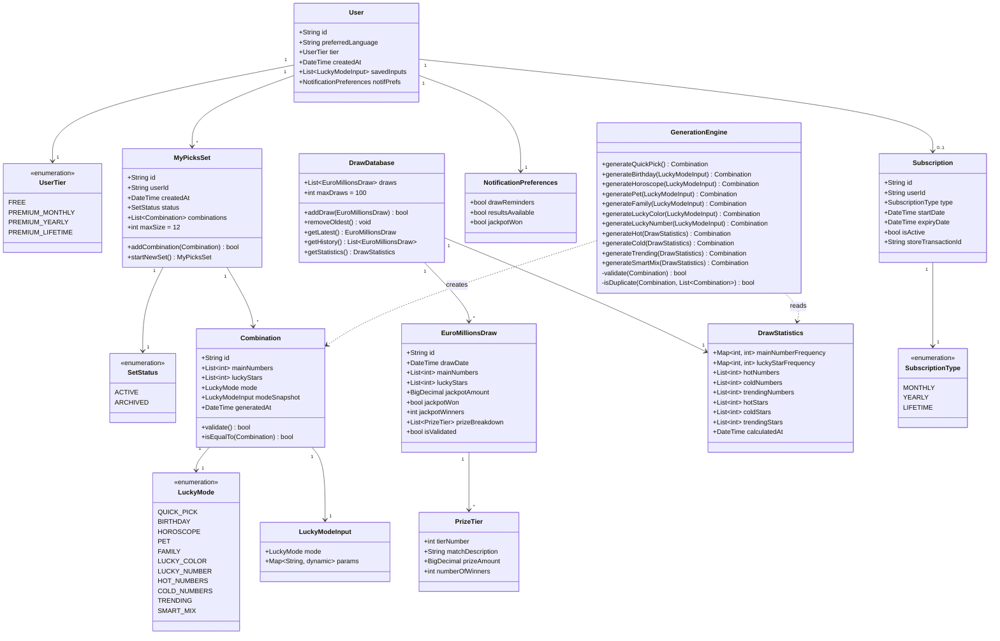
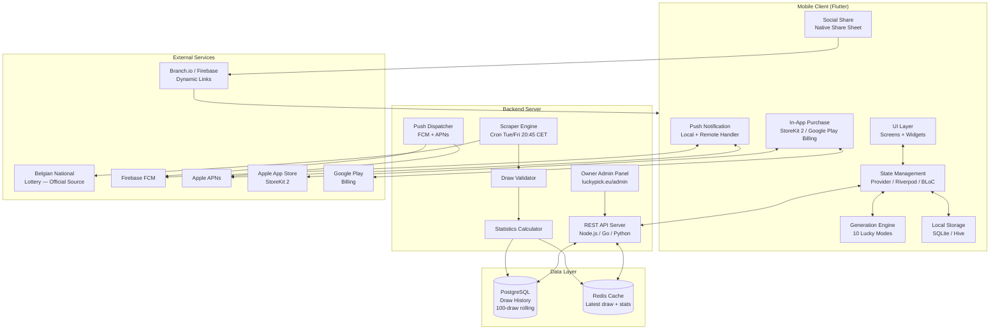
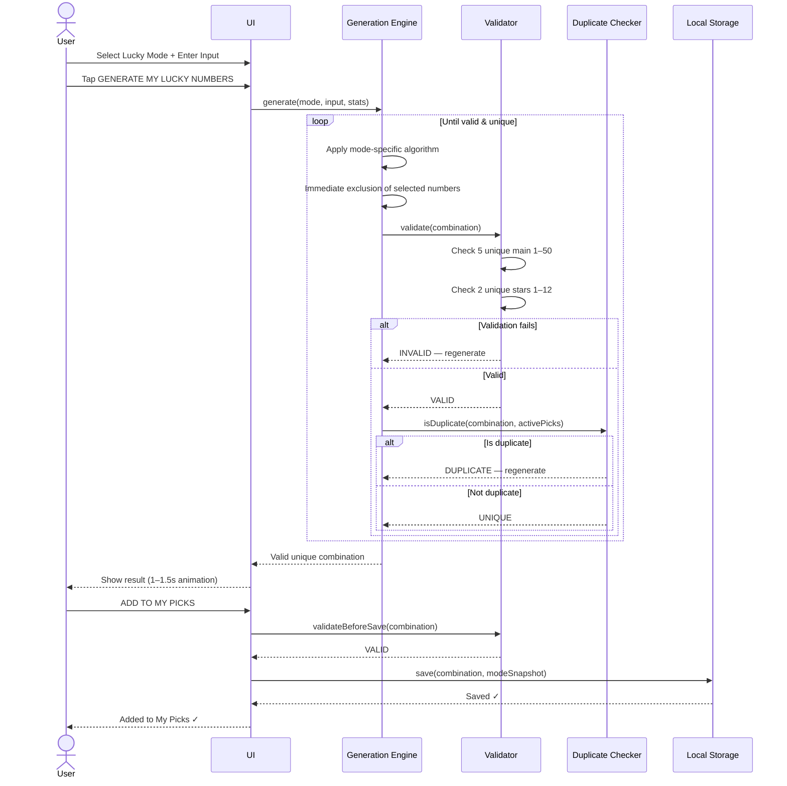
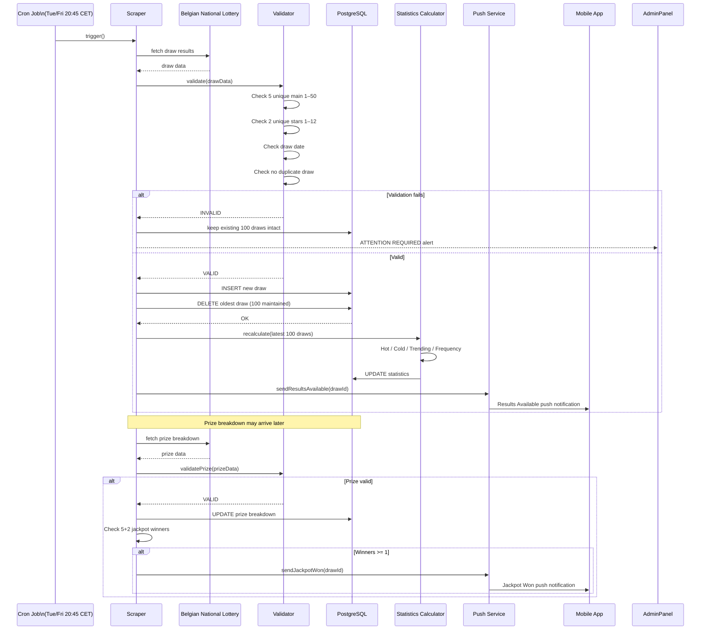
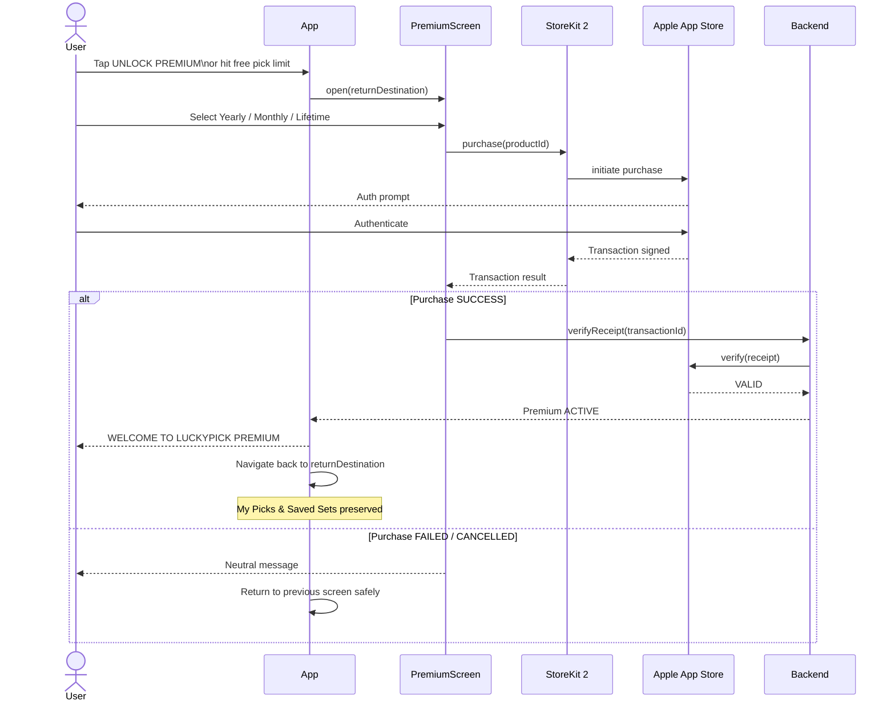
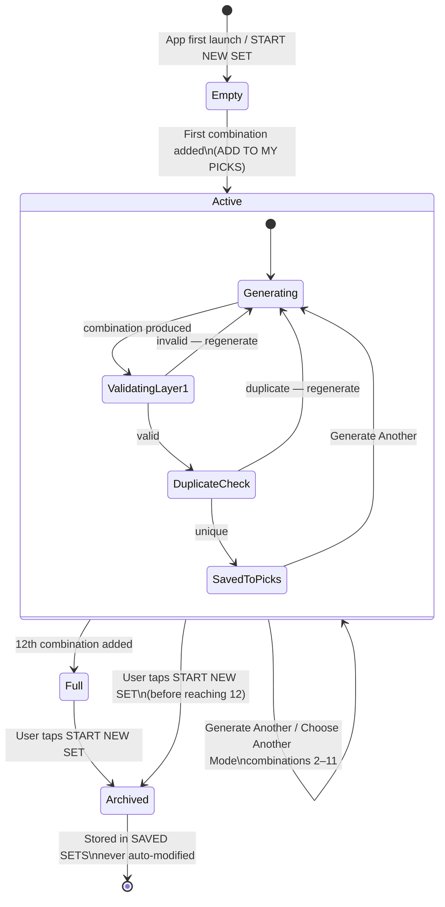
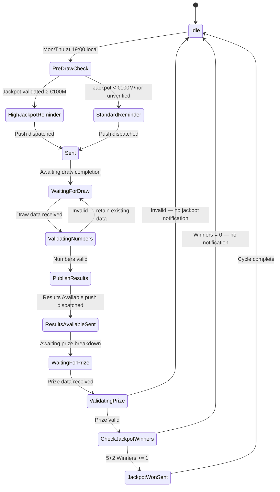
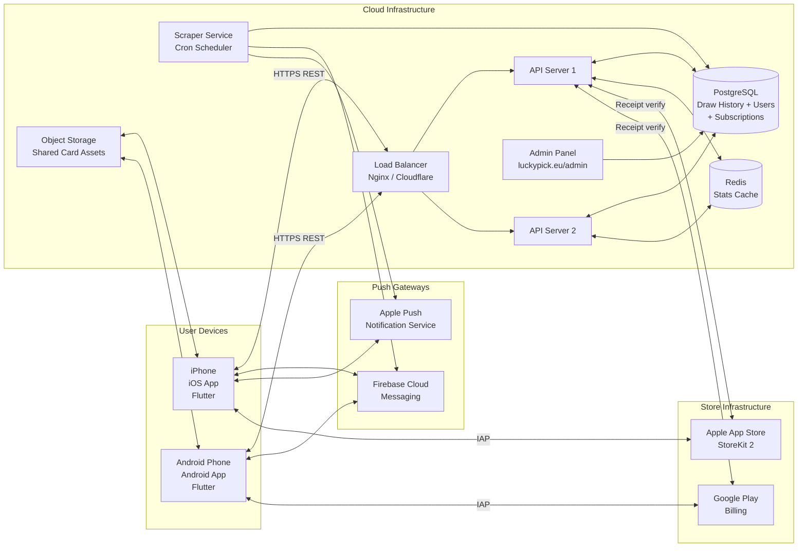

#  UML Diagrams

Structural and behavioural models for the LuckyPick EuroMillions system.

---

##  1. Domain Class Diagram

---

##  2. System Component Diagram

---

##  3. Sequence Diagram — Lucky Mode Generation

---

##  4. Sequence Diagram — Backend Draw Ingestion

---

##  5. Sequence Diagram — Premium Purchase (iOS)

---

##  6. State Machine — My Picks Set

---

##  7. State Machine — Notification Decision

---

##  8. Deployment Diagram

